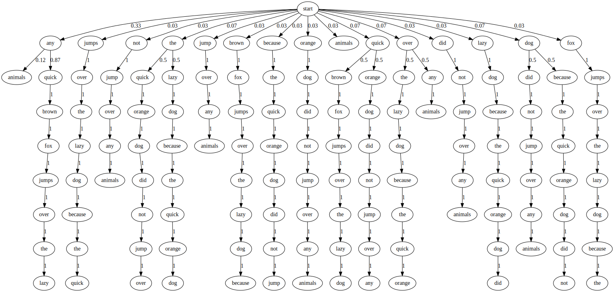

This is an implementation of a new way to do higher-order Markov chains. Where conventionally a Markov chain would use a matrix with one row for each n-gram of the input, this uses a tree.

As far as I can tell, this would use less memory than a matrix, might improve probability searching capabilities, but might also slightly slow down the search (as it will have to traverse the tree instead of just looking up the particular cell in a matrix).

> A tree showing the probabilities of transitioning to a given state based on the previous 8 states. This was generated from the set of 1-,2-,...,8-grams of words of the sentence "any quick brown fox jumps over the lazy dog because the quick orange dog did not jump over any animals".

## Future Work

 - Extract punctuation from input files as separate states when `-kind = "word"`.